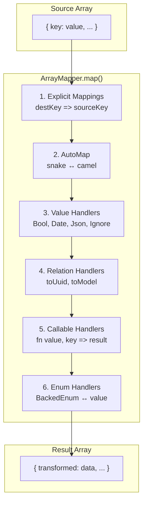

# ArrayMapper - Documentation Détaillée

`ArrayMapper` transforme des tableaux entre deux formats (typiquement DB ↔ Model). C'est la pierre angulaire du mapping dans Cortex.

**Fichier source** : `src/Component/Mapper/ArrayMapper.php`

**Voir aussi** : [ModelRepresentation](./representation.md) — systeme de normalisation
avec groupes, heritage, propagation et security qui s'appuie sur ArrayMapper.

## Table des matières

1. [Vue d'ensemble](#vue-densemble)
2. [Architecture Interne](#architecture-interne)
3. [Flux de Transformation](#flux-de-transformation)
4. [Enum Strategy](#enum-strategy)
5. [Enum Value](#enum-value)
6. [Classe Relation](#classe-relation)
7. [Méthode mapValue()](#méthode-mapvalue)
8. [Exemples Complets](#exemples-complets)
9. [Cas d'usage Avancés](#cas-dusage-avancés)
10. [Différences avec Symfony Serializer](#différences-avec-symfony-serializer)

---

## Vue d'ensemble

`ArrayMapper` implémente l'interface `Mapper` et permet de transformer un tableau source en tableau destination selon des règles configurables.

```php
use Cortex\Component\Mapper\ArrayMapper;
use Cortex\Component\Mapper\Strategy;
use Cortex\Component\Mapper\Value;

$mapper = new ArrayMapper(
    mapping: [
        'uuid' => fn(string $uuid) => new Uuid($uuid),
        'isActive' => Value::Bool,
    ],
    format: Strategy::AutoMapCamel
);

$result = $mapper->map($dbRow);
```

---

## Architecture Interne

```
ArrayMapper
├── $mapping : array          # Règles de transformation {destKey => sourceKey|Value|Relation|callable}
├── $format : Strategy        # Conversion de clés (AutoMapCamel, AutoMapSnake)
├── $automap : Strategy       # AutoMapAll ou AutoMapNone
└── map($source) : array      # Méthode principale
```

### Constructeur

```php
public function __construct(
    array $mapping = [],           // Règles explicites
    array $sourceKeys = [],        // Clés sources à mapper automatiquement
    Strategy $format = Strategy::AutoMapSnake,  // Conversion des clés
    Strategy $automap = Strategy::AutoMapAll,   // Inclure toutes les clés ou seulement explicites
)
```

**Paramètres détaillés :**

| Paramètre | Type | Défaut | Description |
|-----------|------|--------|-------------|
| `$mapping` | `array` | `[]` | Règles de mapping explicites |
| `$sourceKeys` | `array` | `[]` | Clés sources à inclure automatiquement |
| `$format` | `Strategy` | `AutoMapSnake` | Format de conversion des clés |
| `$automap` | `Strategy` | `AutoMapAll` | Stratégie d'automap |

### Initialisation des mappings

```php
// Le constructeur convertit les clés selon la stratégie $format
$this->mapping = array_combine(
    array_map(fn (string $key) => $this->strategize($key), array_keys($mapping)),
    array_values($mapping),
);

// Les sourceKeys sont ajoutées si pas déjà présentes
foreach ($sourceKeys as $sourceKey) {
    $key = $this->strategize($sourceKey);
    if (!isset($this->mapping[$key])) {
        $this->mapping[$key] = $sourceKey;
    }
}
```

---

## Flux de Transformation

Le diagramme suivant visualise les étapes de transformation d'un tableau source vers le résultat :



**Détail des étapes :**

```
Source Array
    │
    ▼
┌───────────────────────────────────────┐
│ 1. Explicit Mappings                  │
│    destKey => sourceKey               │
│    Copie source[sourceKey] → dest[destKey]
└───────────────────────────────────────┘
    │
    ▼
┌───────────────────────────────────────┐
│ 2. AutoMap (si AutoMapAll)            │
│    Pour chaque clé source non mappée  │
│    Convertit selon $format            │
│    snake_case ↔ camelCase             │
└───────────────────────────────────────┘
    │
    ▼
┌───────────────────────────────────────┐
│ 3. Value Handlers                     │
│    Value::Bool  → int ↔ bool          │
│    Value::Date  → string ↔ DateTime   │
│    Value::Json  → string ↔ array      │
│    Value::Ignore → supprime la clé    │
└───────────────────────────────────────┘
    │
    ▼
┌───────────────────────────────────────┐
│ 4. Relation Handlers                  │
│    Relation::toUuid() → extrait UUID  │
│    Relation::toModel() → renomme clé  │
└───────────────────────────────────────┘
    │
    ▼
┌───────────────────────────────────────┐
│ 5. Callable Handlers                  │
│    fn($value, $key, ...$context)      │
│    Transformation personnalisée       │
└───────────────────────────────────────┘
    │
    ▼
┌───────────────────────────────────────┐
│ 6. Enum Class Handlers                │
│    BackedEnum::class → enum ↔ value   │
│    Conversion bidirectionnelle        │
└───────────────────────────────────────┘
    │
    ▼
Result Array
```

### Méthode map()

```php
public function map($source, &$result = [], ...$context): array
```

**Étapes d'exécution :**

1. **Conversion de l'objet** : Si `$source` est un objet, il est converti en array via `get_object_vars()`

2. **Mappings explicites** : Pour chaque mapping dont la valeur est une string (clé source), copie la valeur

3. **AutoMap** : Si `AutoMapAll`, itère sur toutes les clés sources non encore mappées

4. **Handlers spéciaux** : Applique les handlers selon le type du mapping :
   - `Value::Ignore` → skip
   - `Value::Json` → encode/decode JSON
   - `Value::Date` → parse/format date
   - `Value::Bool` → conversion int ↔ bool
   - `Relation` → extraction UUID ou renommage
   - `callable` → transformation custom
   - `BackedEnum::class` → conversion enum ↔ value

---

## Enum Strategy

**Fichier source** : `src/Component/Mapper/Strategy.php`

```php
enum Strategy
{
    case AutoMapCamel;  // snake_case → camelCase (DB → Model)
    case AutoMapSnake;  // camelCase → snake_case (Model → DB)
    case AutoMapNone;   // Seulement les clés explicites
    case AutoMapAll;    // Toutes les clés (défaut)
}
```

### Comportement de conversion

| Strategy | Input | Output |
|----------|-------|--------|
| `AutoMapCamel` | `first_name` | `firstName` |
| `AutoMapCamel` | `is_active` | `isActive` |
| `AutoMapSnake` | `firstName` | `first_name` |
| `AutoMapSnake` | `isActive` | `is_active` |

### Usage typique

```php
// tableToModelMapper (DB → Model)
$mapper = new ArrayMapper(
    mapping: [...],
    format: Strategy::AutoMapCamel  // snake → camel
);

// modelToTableMapper (Model → DB)
$mapper = new ArrayMapper(
    mapping: [...],
    format: Strategy::AutoMapSnake  // camel → snake
);
```

---

## Enum Value

**Fichier source** : `src/Component/Mapper/Value.php`

```php
enum Value: string
{
    case Ignore = 'ignore';  // Supprime la clé du résultat
    case Json = 'json';      // Encode/décode JSON (array ↔ string)
    case Date = 'date';      // Parse/format date (string ↔ DateTimeImmutable)
    case Bool = 'bool';      // Convertit (int ↔ bool, 0/1 ↔ true/false)
}
```

### Comportement bidirectionnel

#### Value::Bool

```php
// DB → Model (int → bool)
1 → true
0 → false

// Model → DB (bool → int)
true → 1
false → 0
```

#### Value::Date

Utilise `DateString` pour la conversion.

```php
// DB → Model (string → DateTimeImmutable)
'2024-01-15 10:30:00' → DateTimeImmutable

// Model → DB (DateTimeImmutable → string)
DateTimeImmutable → '2024-01-15 10:30:00'
```

**Format par défaut** : `'Y-m-d H:i:s'`

#### Value::Json

Utilise `JsonString` pour la conversion.

```php
// DB → Model (string → array)
'{"key":"value"}' → ['key' => 'value']

// Model → DB (array → string)
['key' => 'value'] → '{"key":"value"}'
```

#### Value::Ignore

```php
// La clé est simplement ignorée
['field' => 'value', 'ignored' => 'data']
// avec 'ignored' => Value::Ignore
→ ['field' => 'value']
```

---

## Classe Relation

**Fichier source** : `src/Component/Mapper/Relation.php`

```php
final class Relation
{
    private function __construct(
        public readonly string $column,     // Nom de la colonne cible
        public readonly bool $nullable,     // Autorise null
        public readonly string $property,   // Propriété à extraire (défaut: 'uuid')
    ) {}
}
```

### Méthodes statiques

#### Relation::toUuid()

Utilisé dans `modelToTableMapper` pour extraire l'UUID d'un objet relation.

```php
public static function toUuid(string $column, bool $nullable = false): self
```

**Exemple :**

```php
// Mapping
'organisation' => Relation::toUuid('organisation_uuid')

// Input (Model)
['organisation' => Organisation{uuid: '550e8400-...'}]

// Output (DB)
['organisation_uuid' => '550e8400-...']
```

**Avec nullable :**

```php
// Mapping
'parent' => Relation::toUuid('parent_uuid', nullable: true)

// Input (Model) - relation null
['parent' => null]

// Output (DB)
['parent_uuid' => null]
```

#### Relation::toModel()

Utilisé dans `tableToModelMapper` pour renommer une colonne FK vers le nom de propriété.

```php
public static function toModel(string $property): self
```

**Exemple :**

```php
// Mapping
'organisation_uuid' => Relation::toModel('organisation')

// Input (DB)
['organisation_uuid' => '550e8400-...']

// Output (Model)
['organisation' => '550e8400-...']
// Le resolver résoudra ensuite l'UUID en objet
```

### Flux complet d'une relation

```
Model → DB (persist)
┌────────────────────────┐
│ organisation: Object   │
│   └── uuid: '550e...'  │
└────────────────────────┘
         │
         ▼  Relation::toUuid('organisation_uuid')
┌────────────────────────┐
│ organisation_uuid:     │
│   '550e8400-...'       │
└────────────────────────┘

DB → Model (fetch)
┌────────────────────────┐
│ organisation_uuid:     │
│   '550e8400-...'       │
└────────────────────────┘
         │
         ▼  Relation::toModel('organisation')
┌────────────────────────┐
│ organisation:          │
│   '550e8400-...'       │
└────────────────────────┘
         │
         ▼  Middleware résolution
┌────────────────────────┐
│ organisation: Object   │
│   └── uuid: '550e...'  │
└────────────────────────┘
```

---

## Méthode mapValue()

Transforme une valeur pour l'insertion dans le résultat.

```php
private function mapValue(mixed $value, string $sourceKey, string $destKey): mixed
```

### Types supportés

| Type | Comportement |
|------|--------------|
| `null` | Passthrough |
| `scalar` (int, float, string, bool) | Passthrough |
| `\Stringable` | Cast en string |
| `array` | Passthrough |
| `\JsonSerializable` | Encode en JSON string |
| `\BackedEnum` | Extrait `->value` |
| Autre objet | `InvalidArgumentException` |

### Exemple avec BackedEnum

```php
enum OrganisationType: string
{
    case Club = 'club';
    case Association = 'association';
}

// Mapping bidirectionnel
'type' => OrganisationType::class

// DB → Model
'club' → OrganisationType::Club

// Model → DB
OrganisationType::Club → 'club'
```

---

## Exemples Complets

### Exemple 1 : Contact simple

```php
// tableToModelMapper (DB → Model)
$tableToModel = new ArrayMapper(
    mapping: [
        'uuid' => fn(string $uuid) => new Uuid($uuid),
        'email' => fn(string $email) => new Email($email),
        'allowMailing' => Value::Bool,
        'allowSms' => Value::Bool,
        'archivedAt' => Value::Date,
    ],
    format: Strategy::AutoMapCamel
);

// Entrée DB :
$dbRow = [
    'uuid' => '550e8400-e29b-41d4-a716-446655440000',
    'email' => 'test@example.com',
    'allow_mailing' => 1,
    'allow_sms' => 0,
    'archived_at' => null,
    'first_name' => 'Jean',
    'last_name' => 'Dupont',
];

// Sortie Model :
$modelData = $tableToModel->map($dbRow);
// [
//     'uuid' => Uuid instance,
//     'email' => Email instance,
//     'allowMailing' => true,
//     'allowSms' => false,
//     'archivedAt' => null,
//     'firstName' => 'Jean',
//     'lastName' => 'Dupont',
// ]
```

### Exemple 2 : Club avec relation

```php
// modelToTableMapper (Model → DB)
$modelToTable = new ArrayMapper([
    'organisation' => Relation::toUuid('organisation_uuid'),
    'ffbNumber' => 'ffb_number',
    'isActive' => fn($v) => ['is_active' => $v ? 1 : 0],
]);

// Entrée Model :
$model = [
    'uuid' => new Uuid('550e8400-...'),
    'organisation' => new Organisation(uuid: new Uuid('660e9500-...')),
    'ffbNumber' => '12345',
    'isActive' => true,
    'name' => 'Club de Bridge',
];

// Sortie DB :
$dbData = $modelToTable->map($model);
// [
//     'uuid' => '550e8400-...',
//     'organisation_uuid' => '660e9500-...',
//     'ffb_number' => '12345',
//     'is_active' => 1,
//     'name' => 'Club de Bridge',
// ]
```

### Exemple 3 : Organisation complète

```php
use Domain\Contact\Enum\OrganisationType;

// tableToModelMapper
$tableToModel = new ArrayMapper(
    mapping: [
        'uuid' => fn(string $uuid) => new Uuid($uuid),
        'type' => OrganisationType::class,
        'parent_uuid' => Relation::toModel('parent'),
    ],
    format: Strategy::AutoMapCamel
);

// modelToTableMapper
$modelToTable = new ArrayMapper([
    'name' => 'name',
    'type' => OrganisationType::class,
    'parent' => Relation::toUuid('parent_uuid', nullable: true),
    'legalName' => 'legal_name',
    'siret' => 'siret',
]);
```

---

## Cas d'usage Avancés

### Callable avec contexte

Le callable reçoit la valeur, la clé de destination, et tout contexte additionnel passé à `map()`.

```php
$mapper = new ArrayMapper([
    'price' => fn($value, $key, $currency) => $value * $currency->rate,
]);

$result = $mapper->map($data, context: $eurCurrency);
```

### Transformation vers plusieurs clés

Un callable peut retourner un array pour créer plusieurs clés.

```php
$mapper = new ArrayMapper([
    'fullAddress' => fn($v) => [
        'street' => $v->street,
        'city' => $v->city,
        'zip' => $v->zipCode,
    ],
]);
```

### Combinaison de stratégies

```php
// Mapper qui copie certaines clés et ignore le reste
$mapper = new ArrayMapper(
    mapping: [
        'id' => 'uuid',
        'name' => 'name',
        'other' => Value::Ignore,
    ],
    automap: Strategy::AutoMapNone  // Seulement les clés explicites
);
```

### Classes utilitaires

#### DateString

```php
use Cortex\Component\Date\DateString;

// Parse une string en DateTimeImmutable
$date = new DateString('2024-01-15 10:30:00');
$dateTime = $date->parse();  // DateTimeImmutable

// Format une date en string
$date = new DateString($dateTimeObject);
$string = $date->format();  // '2024-01-15 10:30:00'
```

#### JsonString

```php
use Cortex\Component\Json\JsonString;

// Parse JSON string en array
$json = new JsonString('{"key":"value"}');
$array = $json->decode();  // ['key' => 'value']

// Encode array en JSON string
$json = new JsonString(['key' => 'value']);
$string = (string) $json;  // '{"key":"value"}'
```

---

## Differences avec Symfony Serializer

Cortex `ArrayMapper` et Symfony `Serializer/Normalizer` font tous les deux du mapping
array <-> object. Le choix de design est different.

### Ou vit le mapping ?

**Cortex** — dans l'infrastructure, explicite :

```php
// Infrastructure/Doctrine/PageMapper.php
$toModel = new ArrayMapper([
    'uuid'      => fn(string $v) => new Uuid($v),
    'status'    => PageStatus::class,
    'metadata'  => Value::Json,
    'isActive'  => Value::Bool,
    'createdAt' => Value::Date,
], format: Strategy::AutoMapCamel);
```

**Sf Serializer** — sur le modele, via attributs PHP :

```php
// Domain/Model/Page.php
class Page {
    #[Groups(['list', 'detail'])]
    public Uuid $uuid;

    #[SerializedName('is_active')]
    public bool $isActive;

    #[Ignore]
    private string $internalCache;
}
```

Le Serializer Sf couple le Domain au format de serialisation. Dans une architecture DDD,
le modele ne doit rien savoir de comment il est persiste ou presente. C'est la
responsabilite de l'infrastructure.

### Comment la transformation fonctionne

| | Cortex ArrayMapper | Sf ObjectNormalizer |
|---|---|---|
| **Mecanisme** | Lookup table, 1-2 passes O(n) | Chain of Responsibility, n champs x m normalizers |
| **Discovery** | Aucune — tout est declare | Reflection + TypeInfo + PropertyAccessor |
| **Reflection** | Zero au runtime | Au premier appel, puis cache statique |
| **Bidirectionnalite** | Explicite : 2 mappers separes par sens | Implicite : 1 normalizer fait les 2 sens |
| **Type conversions** | `Value::Bool`, `Value::Date`, `Value::Json`, enum, callable | Normalizers dedies (DateTimeNormalizer, UidNormalizer, BackedEnumNormalizer...) |
| **Relations** | `Relation::toUuid()` / `Relation::toModel()` | Recursion automatique + `#[MaxDepth]` |

### Pourquoi pas le Serializer ?

1. **DDD** — le mapping est un detail d'infrastructure. Mettre `#[Groups]`, `#[SerializedName]`
   ou `#[Ignore]` sur un modele Domain, c'est coupler la presentation au metier.

2. **Explicite > magique** — on lit le mapper, on sait exactement ce qui se passe. Pas de
   "quel normalizer dans la chaine a intercepte ma valeur ?".

3. **Bidirectionnalite consciente** — deux mappers distincts forcent a penser les deux sens
   de la transformation. Le Serializer fait normalize/denormalize avec le meme code, ce qui
   masque les asymetries (un champ serialise mais pas deserialise se decouvre au runtime).

4. **Performance** — ~25% plus rapide en warm (benchmark sur un modele 13 champs avec dates,
   enums, bools, json, uuid). Pas de Reflection au runtime, pas de chain traversal. Le cout
   est O(n) constant et previsible.

5. **Agnostique** — `ArrayMapper` transforme des arrays/objects. Il ne suppose pas de format
   de sortie (JSON, XML) ni de source (DB, API, webhook, message). Chaque adapter definit
   son propre mapper.

### Ce que le Serializer Sf apporte en plus

- **Multi-format** — JSON, XML, CSV, YAML via les Encoders.
- **Groups** — filtrer dynamiquement les champs par contexte (`admin` vs `public`).
- **Circular references** — detection et handler natif.
- **Polymorphisme** — `#[DiscriminatorMap]` pour les hierarchies de classe.
- **Ecosystem** — API Platform, Messenger et tout Sf s'appuient dessus.

### Quand utiliser quoi

| Couche | Outil |
|--------|-------|
| Source externe (DB, API, webhook) <-> Domain Model | **Cortex ArrayMapper** |
| Domain Model <-> API JSON publique multi-format | Sf Serializer (via un Normalizer custom qui delegue au mapper) |
| DTO <-> Domain Model | **Cortex ArrayMapper** ou Sf ObjectMapper |
| Export bulk (CSV, rapports) | Sf Serializer + encoders |

Les deux systemes sont complementaires. L'ArrayMapper gere la transformation metier
dans l'infra, le Serializer peut se brancher au-dessus pour les besoins de presentation
multi-format sans polluer le domaine.
