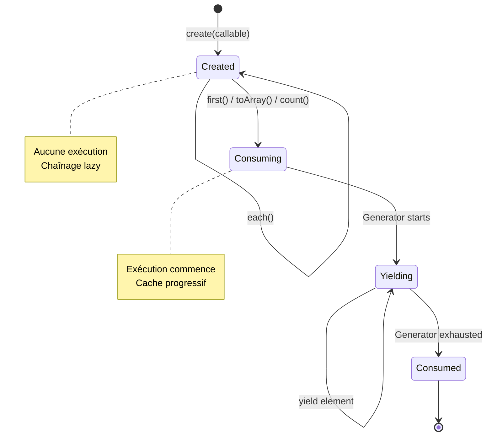

# AsyncCollection / ModelCollection - Documentation Détaillée

Collections lazy avec propagation de contexte. Les données ne sont chargées qu'au moment de la consommation.

**Fichiers sources** :
- `src/Component/Collection/AsyncCollection.php`
- `src/Component/Model/ModelCollection.php`

## Table des matières

1. [Vue d'ensemble](#vue-densemble)
2. [AsyncCollection - Architecture](#asynccollection---architecture)
3. [Lazy Evaluation - Mécanisme](#lazy-evaluation---mécanisme)
4. [Méthode then() - Coeur du Chaînage](#méthode-then---coeur-du-chaînage)
5. [Méthodes Lazy](#méthodes-lazy)
6. [Méthodes Eager](#méthodes-eager)
7. [ModelCollection - Extension Spécialisée](#modelcollection---extension-spécialisée)
8. [Collections Typées](#collections-typées)
9. [Exemples Complets](#exemples-complets)

---

## Vue d'ensemble

`AsyncCollection` est une collection générique qui implémente la lazy evaluation. Les transformations sont empilées sans exécution jusqu'à ce qu'une méthode "terminale" soit appelée.

```php
use Cortex\Component\Collection\AsyncCollection;

// Création - aucune donnée n'est chargée
$collection = AsyncCollection::create(function() {
    yield from $this->loadExpensiveData();
});

// Chaînage - crée de nouvelles collections sans exécution
$filtered = $collection
    ->map(fn($x) => $x * 2)     // Pas d'exécution
    ->filter(fn($x) => $x > 10); // Pas d'exécution

// Consommation - l'exécution commence ici
$first = $filtered->first();  // Exécute jusqu'au premier match
$all = $filtered->toArray();  // Exécute tout
```

---

## AsyncCollection - Architecture

```
AsyncCollection<T>
├── $elements : array         # Cache des éléments déjà consommés
├── $origin : ?Generator      # Source des données (lazy)
├── $innerIterator : ?Generator  # Itérateur interne
│
├── create(iterable|callable) # Factory statique
├── map(callable) : static    # Transformation lazy
├── filter(callable) : static # Filtrage lazy
├── reduce(callable) : mixed  # Terminateur (eager)
├── first() : ?T              # Premier élément (eager)
├── toArray() : array         # Tous les éléments (eager)
└── then(iterable, ?class) : static  # Chaînage avec changement de type
```

### Interfaces implémentées

```php
class AsyncCollection implements \Iterator, \Countable, \JsonSerializable
```

- `\Iterator` : Permet le `foreach`
- `\Countable` : Permet `count($collection)` (déclenche l'exécution)
- `\JsonSerializable` : Permet `json_encode($collection)`

### Factory statique

```php
public static function create(iterable|callable $origin = []): static
```

**Comportement :**
- Si `$origin` est callable, il sera appelé lors de la première consommation
- Si `$origin` est un Generator, il est utilisé directement
- Si `$origin` est un array/iterable, il est wrappé dans un Generator

```php
// Callable (recommandé pour lazy)
$collection = AsyncCollection::create(fn() => $query->getResults());

// Generator direct
$collection = AsyncCollection::create($existingGenerator);

// Array (converti en generator)
$collection = AsyncCollection::create([1, 2, 3]);
```

---

## Lazy Evaluation - Mécanisme

Le diagramme suivant illustre les états d'une collection et les transitions entre eux :



### Phase 1 : Création

```php
$collection = AsyncCollection::create(function() {
    // Ce code n'est PAS exécuté maintenant
    echo "Loading data...";
    yield from $this->loadExpensiveData();
});
// Rien ne s'affiche
```

### Phase 2 : Chaînage

```php
$transformed = $collection
    ->map(fn($x) => $x * 2)     // Crée nouvelle collection
    ->filter(fn($x) => $x > 10) // Crée nouvelle collection
    ->map(fn($x) => "Value: $x");
// Toujours aucune exécution
```

### Phase 3 : Consommation

```php
// Maintenant l'exécution commence
$first = $transformed->first();
// Affiche "Loading data..."
// Exécute les transformations sur chaque élément
// S'arrête dès qu'un résultat est trouvé
```

### Mécanisme interne

```php
private function getIterator(): \Generator
{
    // D'abord, yield les éléments déjà consommés
    yield from $this->elements;

    // Puis, continue avec l'origin
    while ($this->origin?->valid()) {
        $element = $this->origin->current();
        $key = $this->origin->key();

        // Cache l'élément
        $this->elements[$key] = $element;
        yield $key => $element;

        $this->origin->next();
    }

    // Marque l'origin comme consommé
    $this->origin = null;
}
```

---

## Méthode then() - Coeur du Chaînage

```php
public function then(iterable|callable $next, string|RegisteredClass|null $targetClass = null): static
```

### Comportement

1. Si `$next` est callable, l'appelle avec `$this` pour obtenir l'iterable
2. Crée une nouvelle instance de `$targetClass` (ou `static::class` par défaut)
3. Appelle `onNext()` pour propager les propriétés
4. Retourne la nouvelle instance

### Code

```php
public function then(iterable|callable $next, string|RegisteredClass|null $targetClass = null): static
{
    $nextIterable = is_callable($next) ? $next($this) : $next;

    if (is_null($targetClass)) {
        $targetClass = static::class;
    }
    if (is_string($targetClass)) {
        $targetClass = new RegisteredClass($targetClass);
    }

    $targetClass->assertIsInstanceOf(static::class);

    // Crée la nouvelle instance et propage le contexte
    $this->onNext($nextInstance = new ((string) $targetClass)($nextIterable));

    return $nextInstance;
}
```

### Hook onNext()

Permet aux classes filles de propager leurs propriétés aux nouvelles instances.

```php
// Dans AsyncCollection (base)
protected function onNext(AsyncCollection $nextInstance): void
{
    // Par défaut, ne fait rien
}

// Dans ModelCollection (extension)
protected function onNext(AsyncCollection $nextInstance): void
{
    if (!$nextInstance instanceof self) {
        throw new \BadMethodCallException('Can only be called from ModelCollections.');
    }
    // Propage le query
    $nextInstance->query = $this->query;
}
```

---

## Méthodes Lazy

Ces méthodes retournent une nouvelle `AsyncCollection` sans déclencher l'exécution.

### map()

Transforme chaque élément.

```php
public function map(callable $mapper): static
```

```php
$doubled = $collection->map(fn($x, $key) => $x * 2);
```

**Implémentation :**
```php
public function map(callable $mapper): static
{
    return $this->then(
        fn (self $origin) => (function () use ($origin, $mapper) {
            foreach ($origin as $key => $element) {
                yield $key => $mapper($element, $key);
            }
        })()
    );
}
```

### filter()

Filtre les éléments selon un prédicat.

```php
public function filter(callable $filter): static
```

```php
$active = $collection->filter(fn($x, $key) => $x->isActive);
```

### each()

FlatMap avec générateurs - permet de yield plusieurs éléments par élément source.

```php
public function each(callable $callback): static
```

```php
// Explose chaque élément en plusieurs
$expanded = $collection->each(function($item, $key) {
    yield $item->name;
    yield $item->description;
});
```

### if()

Branchement conditionnel lazy.

```php
public function if(callable $condition, callable $then, ?callable $else = null): static
```

```php
$result = $collection->if(
    condition: fn($c) => $c->count() > 0,
    then: fn($c) => $c->map(fn($x) => $x->transform()),
    else: fn($c) => [new DefaultItem()]
);
```

### ifEmpty()

Raccourci pour gérer les collections vides.

```php
public function ifEmpty(callable $then, ?callable $else = null): static
```

```php
$result = $collection->ifEmpty(
    then: fn() => [new Placeholder()],
    else: fn($c) => $c
);
```

### as()

Change le type de la collection.

```php
public function as(string|RegisteredClass $collectionClass): static
```

```php
$typed = $collection->as(ContactCollection::class);
```

---

## Méthodes Eager

Ces méthodes déclenchent l'exécution et retournent un résultat concret.

### first()

Retourne le premier élément ou null.

```php
public function first(): mixed
```

```php
$item = $collection->first();
// Exécute seulement jusqu'au premier élément
```

### toArray()

Retourne tous les éléments comme array.

```php
public function toArray(): array
```

```php
$all = $collection->toArray();
// Exécute complètement et préserve les clés
```

### count()

Compte les éléments.

```php
public function count(): int
```

```php
$nb = count($collection);  // ou $collection->count()
// Attention: déclenche l'exécution complète
```

### reduce()

Réduit la collection à une seule valeur.

```php
public function reduce(callable $reducer, mixed $initial = null): mixed
```

```php
$sum = $collection->reduce(
    fn($acc, $item, $key) => $acc + $item->value,
    initial: 0
);
```

### find()

Trouve le premier élément matchant le prédicat.

```php
public function find(callable $predicate): mixed
```

```php
$found = $collection->find(fn($x) => $x->uuid === $targetUuid);
```

### at()

Récupère l'élément à un index donné.

```php
public function at(int $index): mixed
```

```php
$third = $collection->at(2);  // Index 0-based
```

### join()

Concatène les éléments en string.

```php
public function join(string $joiner): string
```

```php
$csv = $collection->map(fn($x) => $x->name)->join(', ');
```

---

## ModelCollection - Extension Spécialisée

**Fichier source** : `src/Component/Model/ModelCollection.php`

`ModelCollection` étend `AsyncCollection` pour les collections de modèles avec propagation du query.

```php
class ModelCollection extends AsyncCollection
{
    public private(set) ?ModelQuery $query = null;

    public static function build(ModelQuery $query): static
    {
        // Passe une closure pour lazy resolution
        $collection = static::create(fn () => $query->resolve());
        $collection->query = $query;
        return $collection;
    }

    protected function onNext(AsyncCollection $nextInstance): void
    {
        if (!$nextInstance instanceof self) {
            throw new \BadMethodCallException('Can only be called from ModelCollections.');
        }
        // Propage le query vers les collections chaînées
        $nextInstance->query = $this->query;
    }
}
```

### Pourquoi la propagation du query ?

Après un chaînage `->filter()->map()`, le template peut toujours accéder à :
- `$collection->query->pager` : Information de pagination
- `$collection->query->sorter` : Tri actuel
- `$collection->query->filters` : Filtres appliqués

```twig
{# Le query est accessible même après transformation #}


    Page {{ filtered.query.pager.page }} / {{ filtered.query.pager.nbRecords }}

```

---

## Collections Typées

Créez des collections typées en héritant de `ModelCollection`.

```php
use Cortex\Component\Model\ModelCollection;
use Cortex\ValueObject\RegisteredClass;
use Domain\Contact\Model\Contact;

class ContactCollection extends ModelCollection
{
    protected static function expectedType(): ?RegisteredClass
    {
        return new RegisteredClass(Contact::class);
    }
}
```

### Effet du typage

Lors de la création via `create()`, chaque élément est validé :

```php
public static function create(iterable|callable $origin = []): static
{
    $collection = new static($origin);
    $expectedType = static::expectedType();

    return $expectedType === null ? $collection :
        $collection->filter(fn (mixed $element) => $expectedType->assertInstanceOf($element))
    ;
}
```

---

## Exemples Complets

### Exemple 1 : Collection lazy avec transformations

```php
// Création lazy
$users = AsyncCollection::create(function() {
    $pdo = new PDO(...);
    $stmt = $pdo->query('SELECT * FROM users');
    while ($row = $stmt->fetch(PDO::FETCH_ASSOC)) {
        yield $row['id'] => new User($row);
    }
});

// Chaînage (pas d'exécution)
$activeAdmins = $users
    ->filter(fn(User $u) => $u->isActive)
    ->filter(fn(User $u) => $u->role === 'admin')
    ->map(fn(User $u) => $u->email);

// Exécution à la demande
$firstAdmin = $activeAdmins->first();  // S'arrête au premier match
$allAdmins = $activeAdmins->toArray(); // Exécute tout
```

### Exemple 2 : ModelCollection avec factory

```php
// Dans ContactFactory
public function query(): ModelQuery
{
    return $this->queryFactory->createQuery(
        modelCollectionClass: $this->collectionClass,
        filters: $this->modelPrototype->constructors->prototype(),
        resolver: fn (ModelQuery $query) => $this->fetchingMiddlewares
            ->compile($query)
            ->map(fn (array $modelData) => $this->instancePipeline($modelData))
            ->filter(fn ($model) => $model !== null)
    );
}

// Utilisation
$contacts = $contactFactory->query()
    ->filterBy('isActive', true)
    ->getCollection();

// La query SQL n'est pas encore exécutée
$filtered = $contacts->filter(fn($c) => $c->email->endsWith('@domain.com'));

// Exécution
$list = $filtered->toArray();
// Le query original est toujours accessible
$pager = $filtered->query->pager;
```

### Exemple 3 : Branchement conditionnel

```php
$results = AsyncCollection::create(fn() => $searchResults)
    ->if(
        fn($c) => $c->count() > 100,
        then: fn($c) => $c->filter(fn($x) => $x->relevance > 0.8)->map(fn($x) => $x->highlight()),
        else: fn($c) => $c->map(fn($x) => $x->summarize())
    );
```

### Exemple 4 : FlatMap avec each()

```php
// Chaque utilisateur a plusieurs adresses
$allAddresses = $users->each(function(User $user, $key) {
    foreach ($user->addresses as $address) {
        yield $address;
    }
});

// Équivalent à un flatMap
$formatted = $users->each(function(User $user) {
    yield "{$user->name} (primary)";
    foreach ($user->aliases as $alias) {
        yield "{$alias} (alias)";
    }
});
```

### Exemple 5 : Reduce pour agrégation

```php
$stats = $orders->reduce(
    fn($acc, Order $order) => [
        'total' => $acc['total'] + $order->amount,
        'count' => $acc['count'] + 1,
        'max' => max($acc['max'], $order->amount),
    ],
    initial: ['total' => 0, 'count' => 0, 'max' => 0]
);
// $stats = ['total' => 15000, 'count' => 42, 'max' => 500]
```

### Exemple 6 : Collection vide avec fallback

```php
$results = $searchService->search($query)
    ->ifEmpty(
        then: fn() => [new NoResultPlaceholder()],
        else: fn($c) => $c->map(fn($r) => new SearchResult($r))
    );
```
