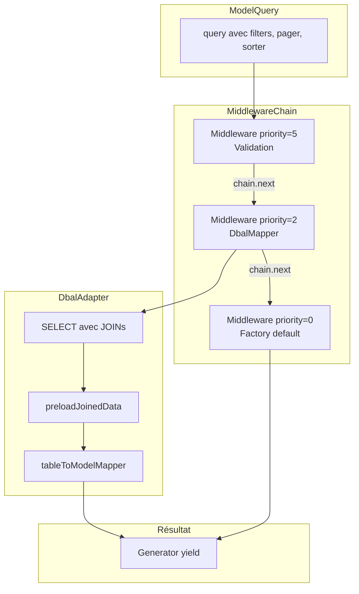
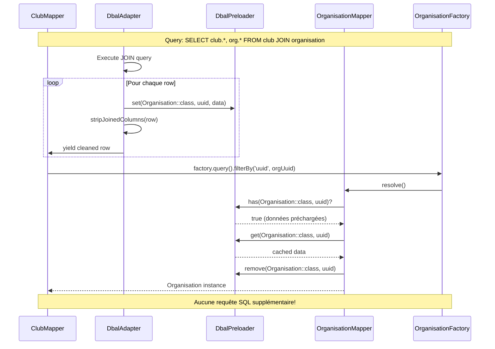

# Bridge/Doctrine - Documentation Détaillée

Persistence DBAL avec support des JOINs et prévention des problèmes N+1 via preloading.

**Fichiers sources** :
- `src/Bridge/Doctrine/DbalAdapter.php`
- `src/Bridge/Doctrine/DbalMappingConfiguration.php`
- `src/Bridge/Doctrine/JoinDefinition.php`
- `src/Bridge/Doctrine/DbalPreloader.php`
- `src/Bridge/Doctrine/DbalBridge.php`
- `src/Bridge/Doctrine/DbalModelAdapterTrait.php`

## Table des matières

1. [Architecture Globale](#architecture-globale)
2. [DbalMappingConfiguration](#dbalmappingconfiguration)
3. [JoinDefinition](#joindefinition)
4. [DbalAdapter](#dbaladapter)
5. [DbalPreloader](#dbalpreloader)
6. [DbalBridge & Trait](#dbalbridge--trait)
7. [Opérateurs de Filtre](#opérateurs-de-filtre)
8. [Exemples Complets](#exemples-complets)

---

## Architecture Globale

```
┌────────────────────────────────────────────────────────────────┐
│                         ModelFactory                           │
│  query() → crée ModelQuery avec resolver                       │
└────────────────────────────────────────────────────────────────┘
                              │
                              ▼
┌────────────────────────────────────────────────────────────────┐
│                      MiddlewareChain                           │
│  Middlewares ordonnés par priorité (haut → bas)               │
│  ┌──────────────┐ ┌──────────────┐ ┌──────────────┐           │
│  │ Validation   │→│ DbalMapper   │→│ Factory      │           │
│  │ (priority:3) │ │ (priority:2) │ │ (priority:1) │           │
│  └──────────────┘ └──────────────┘ └──────────────┘           │
└────────────────────────────────────────────────────────────────┘
                              │
                              ▼
┌────────────────────────────────────────────────────────────────┐
│                       DbalAdapter                              │
│  - Génère SQL (SELECT, INSERT, UPDATE, DELETE)                 │
│  - Gère JOINs et preloading                                    │
│  - Exécute via Doctrine DBAL                                   │
└────────────────────────────────────────────────────────────────┘
                              │
                              ▼
┌────────────────────────────────────────────────────────────────┐
│                    Doctrine DBAL Connection                    │
└────────────────────────────────────────────────────────────────┘
```

---

## DbalMappingConfiguration

Configure le mapping entre un modèle et sa table.

**Fichier source** : `src/Bridge/Doctrine/DbalMappingConfiguration.php`

### Constructeur

```php
class DbalMappingConfiguration
{
    public function __construct(
        public readonly string $table,           // Nom de la table
        public readonly ?string $modelClass = null,  // Classe pour preloader
        public readonly array $joins = [],       // JoinDefinition[]
        public readonly ?Mapper $modelToTableMapper = null,
        public readonly ?Mapper $tableToModelMapper = null,
        public readonly string $primaryKey = 'uuid',
        public readonly string $modelIdentifier = 'uuid',
        public readonly string $dataChannel = '_default',
        public readonly string $pivotKey = 'uuid',
    )
}
```

### Paramètres détaillés

| Paramètre | Type | Défaut | Description |
|-----------|------|--------|-------------|
| `table` | `string` | - | Nom de la table SQL |
| `modelClass` | `?string` | `null` | Classe du modèle pour le preloader |
| `joins` | `array` | `[]` | `JoinDefinition[]` indexées par nom de relation |
| `modelToTableMapper` | `?Mapper` | `null` | Convertit Model → DB |
| `tableToModelMapper` | `?Mapper` | `null` | Convertit DB → Model |
| `primaryKey` | `string` | `'uuid'` | Colonne clé primaire |
| `modelIdentifier` | `string` | `'uuid'` | Propriété identifiant du modèle |
| `dataChannel` | `string` | `'_default'` | Canal de données pour middleware |
| `pivotKey` | `string` | `'uuid'` | Clé de regroupement des résultats |

### Méthodes

#### buildJoinClauses()

Génère les clauses SQL JOIN.

```php
public function buildJoinClauses(): string
```

```php
// Avec un join vers organisation
$config->buildJoinClauses();
// " INNER JOIN contact_organisation AS c1 ON club_club.organisation_uuid = c1.uuid"
```

#### buildJoinSelectFields()

Génère les champs SELECT des JOINs.

```php
public function buildJoinSelectFields(): string
```

```php
$config->buildJoinSelectFields();
// "c1.uuid AS c1_uuid, c1.name AS c1_name, c1.type AS c1_type"
```

#### resolveJoinFilter()

Résout un filtre vers une relation jointe. Supporte deux notations :
- **Dot notation** : `relation.field` (ex: `organisation.name`)
- **Underscore notation** : `relation_field` (ex: `organisation_name`) - utile pour les formulaires Symfony qui n'acceptent pas les points

```php
public function resolveJoinFilter(string $filterKey): ?array
```

```php
$config->resolveJoinFilter('organisation.name');
// ['join' => JoinDefinition, 'field' => 'name']

$config->resolveJoinFilter('contact_firstname');  // underscore notation
// ['join' => JoinDefinition (contact), 'field' => 'firstname']

$config->resolveJoinFilter('name');
// null (pas un filtre de join)
```

#### resolveUniqueField()

Résout un champ de déduplication en colonne SQL qualifiée pour `GROUP BY`.

```php
public function resolveUniqueField(string $field): string
```

```php
$config->resolveUniqueField('contact');
// 'contact_role.contact_uuid'  (via modelToTableMapper)

$config->resolveUniqueField('uuid');
// 'contact_role.uuid'  (fallback direct)
```

Le mapping utilise `modelToTableMapper` pour traduire le nom de propriété (ex: `contact`) en nom de colonne (ex: `contact_uuid`).

### Exemple complet

```php
$config = new DbalMappingConfiguration(
    table: 'club_club',
    modelClass: Club::class,
    joins: [
        'organisation' => new JoinDefinition(
            factory: $organisationFactory,
            joinConfig: $organisationMapper->getConfiguration(),
            localKey: 'organisation_uuid',
        ),
    ],
    modelToTableMapper: new ArrayMapper([
        'organisation' => Relation::toUuid('organisation_uuid'),
        'ffbNumber' => 'ffb_number',
        'isActive' => fn($v) => ['is_active' => $v ? 1 : 0],
    ]),
    tableToModelMapper: new ArrayMapper(
        mapping: [
            'uuid' => fn(string $uuid) => new Uuid($uuid),
            'organisation_uuid' => Relation::toModel('organisation'),
            'isActive' => Value::Bool,
        ],
        format: Strategy::AutoMapCamel
    ),
    primaryKey: 'uuid',
);
```

---

## JoinDefinition

Définit une relation JOIN avec découverte automatique des colonnes.

**Fichier source** : `src/Bridge/Doctrine/JoinDefinition.php`

### Constructeur

```php
final readonly class JoinDefinition
{
    public function __construct(
        public ModelFactory $factory,         // Factory du modèle joint
        public DbalMappingConfiguration $joinConfig,  // Config DBAL du joint
        public string $localKey,              // FK dans la table principale
        public JoinType $type = JoinType::Inner,
        ?string $alias = null,                // Auto-généré si null (c1, c2...)
        array $columnOverrides = [],          // Mapping spécial
    )
}
```

### Découverte automatique des colonnes

Les colonnes sont découvertes depuis le `ModelPrototype` de la factory :

```php
// Les paramètres du constructeur du modèle → colonnes snake_case
$this->columns = array_map(
    static fn(string $key) => $columnOverrides[$key] ?? u($key)->snake()->toString(),
    $factory->modelPrototype->constructors->declaredKeys()
);
```

**Exemple** : Si `Organisation` a un constructeur :
```php
public function __construct(
    public Uuid $uuid,
    public string $name,
    public OrganisationType $type,
    public ?Organisation $parent,
)
```

Les colonnes découvertes seront : `['uuid', 'name', 'type', 'parent']`

Avec override `['parent' => 'parent_uuid']` : `['uuid', 'name', 'type', 'parent_uuid']`

### Méthodes

#### toSql()

Génère la clause JOIN SQL.

```php
public function toSql(string $mainTable): string
```

```php
$join->toSql('club_club');
// "INNER JOIN contact_organisation AS c1 ON club_club.organisation_uuid = c1.uuid"
```

#### getSelectFields()

Génère les champs SELECT préfixés.

```php
public function getSelectFields(): string
```

```php
$join->getSelectFields();
// "c1.uuid AS c1_uuid, c1.name AS c1_name, c1.type AS c1_type, c1.parent_uuid AS c1_parent_uuid"
```

#### extractJoinedData()

Extrait les données jointes d'une row résultat.

```php
public function extractJoinedData(array $row): ?array
```

```php
$row = [
    'uuid' => 'club-uuid',
    'name' => 'Club Name',
    'c1_uuid' => 'org-uuid',
    'c1_name' => 'Org Name',
    'c1_type' => 'club',
];

$join->extractJoinedData($row);
// ['uuid' => 'org-uuid', 'name' => 'Org Name', 'type' => 'club']
```

#### getPrefixedColumns()

Retourne les noms de colonnes préfixées.

```php
public function getPrefixedColumns(): array
```

```php
$join->getPrefixedColumns();
// ['c1_uuid', 'c1_name', 'c1_type', 'c1_parent_uuid']
```

### JoinType

```php
enum JoinType: string
{
    case Inner = 'INNER JOIN';
    case Left = 'LEFT JOIN';
    case Right = 'RIGHT JOIN';
}
```

---

## Middleware Chain

Le diagramme suivant illustre l'exécution des middlewares dans la chaîne, ordonnés par priorité :



---

## DbalAdapter

Génère et exécute les requêtes SQL.

**Fichier source** : `src/Bridge/Doctrine/DbalAdapter.php`

### Constructeur

```php
class DbalAdapter
{
    public function __construct(
        protected Connection $dbalConnection,
        private DbalMappingConfiguration $configuration,
        private ?DbalPreloader $preloader = null,
    )
}
```

### Méthodes de génération SQL

#### select()

```php
public function select(
    array $params = [],
    string $fields = '*',
    int $limit = 0,
    ?int $offset = null,
    ?string $sortBy = null,
    string $sortDirection = 'asc',
): string
```

```php
$sql = $adapter->select(
    params: ['is_active' => 1, 'type' => 'club'],
    limit: 20,
    offset: 40,
    sortBy: 'name',
    sortDirection: 'asc'
);
// "SELECT club_club.*, c1.uuid AS c1_uuid, c1.name AS c1_name
//  FROM club_club
//  INNER JOIN contact_organisation AS c1 ON club_club.organisation_uuid = c1.uuid
//  WHERE club_club.is_active = :is_active AND club_club.type = :type
//  ORDER BY club_club.name ASC
//  LIMIT 20 OFFSET 40"
```

#### insert()

```php
public function insert(array $data): string
```

#### update()

```php
public function update(array $data): string
```

#### sync()

Génère un INSERT ... ON DUPLICATE KEY UPDATE.

```php
public function sync(array $data): string
```

#### delete()

```php
public function delete(): string
```

### where()

Génère la clause WHERE avec support des opérateurs.

```php
public function where(array $params): string
```

**Comportements spéciaux :**
- Arrays → `IN ()`
- `null` → `IS NULL`
- Opérateurs préfixés (`>`, `<`, `~`, etc.)

```php
$adapter->where([
    'status' => 'active',       // = :status
    'age' => '>18',             // > :age
    'name' => '~Jean%',         // LIKE :name
    'tags' => ['a', 'b', 'c'],  // IN (:tags)
    'deleted_at' => null,       // IS NULL
]);
// " WHERE status = :status AND age > :age AND name LIKE :name AND tags IN (:tags) AND deleted_at IS NULL"
```

### onModelQuery()

Traite une requête ModelQuery et retourne les résultats mappés.

```php
public function onModelQuery(Middleware $chain, ModelQuery $query): \Generator
```

**Flux d'exécution :**

```php
public function onModelQuery(Middleware $chain, ModelQuery $query): \Generator
{
    // 1. Check preloader pour single-UUID lookup
    if ($uuidFilter && $this->preloader->has($modelClass, $uuid)) {
        yield $uuid => ['_default' => cachedData];
        $this->preloader->remove($modelClass, $uuid);
        return;
    }

    // 2. Map filters via modelToTableMapper
    $filters = $this->configuration->modelToTableMapper->map($query->filters->all());

    // 3. Resolve join filters ("organisation.name" → "c1.name")
    $filters = $this->resolveJoinFilters($filters);

    // 4. Handle unique/GROUP BY
    $groupBy = null;
    if ($query->uniqueField) {
        $groupBy = $this->configuration->resolveUniqueField($query->uniqueField);
    }

    // 5. Handle pagination (avec COUNT DISTINCT si groupBy)
    if ($query->pager) {
        $count = $groupBy
            ? "SELECT COUNT(DISTINCT {$groupBy}) AS count ..."
            : "SELECT COUNT(*) AS count ...";
        $query->pager->bind($count);
    }

    // 6. Execute SELECT with JOINs and GROUP BY
    $results = $this->query($this->select($filters, groupBy: $groupBy, ...));

    // 7. Pour chaque row :
    foreach ($results as $row) {
        // Preload les données jointes
        $this->preloadJoinedData($row);
        // Nettoie les colonnes jointes
        $row = $this->stripJoinedColumns($row);
        // Yield les données mappées
        yield $identifier => [
            '_default' => $this->tableToModelMapper->map($row)
        ];
    }
}
```

### Déduplication avec unique()

Quand `ModelQuery->unique('field')` est défini, `DbalAdapter` génère une clause `GROUP BY` :

```php
// Dans le controller
$query->unique('contact');

// DbalAdapter résout le champ via DbalMappingConfiguration
$groupBy = $config->resolveUniqueField('contact');
// → 'contact_role.contact_uuid'

// SQL généré
SELECT contact_role.contact_uuid, ...
FROM contact_role
WHERE ...
GROUP BY contact_role.contact_uuid
```

**Pagination avec unique** : Le count utilise `COUNT(DISTINCT colonne)` au lieu de `COUNT(*)` :

```sql
SELECT COUNT(DISTINCT contact_role.contact_uuid) AS count
FROM contact_role
WHERE organisation_uuid = :orgUuid
```

### onModelSync()

Traite une commande de synchronisation (INSERT/UPDATE).

```php
public function onModelSync(Middleware $chain, SyncCommand $command): \Generator
```

---

## DbalPreloader

Interface pour le preloading des données JOINées.

**Fichier source** : `src/Bridge/Doctrine/DbalPreloader.php`

### Interface

```php
interface DbalPreloader
{
    // Stocke des données préchargées
    public function set(string $modelClass, string $identifier, array $data): void;

    // Vérifie si des données sont disponibles
    public function has(string $modelClass, string $identifier): bool;

    // Récupère les données
    public function get(string $modelClass, string $identifier): ?array;

    // Supprime après utilisation (consume-once)
    public function remove(string $modelClass, string $identifier): void;

    // Vide le cache pour une classe
    public function clear(string $modelClass): void;
}
```

### Implémentation InMemory

```php
class InMemoryDbalPreloader implements DbalPreloader
{
    private array $cache = [];

    public function set(string $modelClass, string $identifier, array $data): void
    {
        $this->cache[$modelClass][$identifier] = $data;
    }

    public function has(string $modelClass, string $identifier): bool
    {
        return isset($this->cache[$modelClass][$identifier]);
    }

    public function get(string $modelClass, string $identifier): ?array
    {
        return $this->cache[$modelClass][$identifier] ?? null;
    }

    public function remove(string $modelClass, string $identifier): void
    {
        unset($this->cache[$modelClass][$identifier]);
    }

    public function clear(string $modelClass): void
    {
        unset($this->cache[$modelClass]);
    }
}
```

### Diagramme de séquence N+1 Prevention

Le diagramme suivant illustre comment le preloader évite les requêtes N+1 lors de la résolution des relations :



### Flux avec JOIN et Preloader (détail textuel)

```
1. ClubMapper fait SELECT club.*, org.* FROM club JOIN organisation
                              │
2. Pour chaque row :          │
   - extractJoinedData(row) → données org
   - preloader->set(Organisation::class, org_uuid, org_data)
   - stripJoinedColumns(row) → row sans colonnes org
   - tableToModelMapper->map(row) → ['organisation' => org_uuid, ...]
   - Yield les données avec organisation = UUID (string)
                              │
3. Dans le handler onDbal :   │
   - Pour chaque dataLine avec organisation UUID
   - Appelle organisationFactory->query()->filterBy('uuid', orgUuid)
                              │
4. OrganisationMapper :       │
   - Vérifie preloader->has(Organisation::class, uuid)
   - Si oui : utilise preloader->get() au lieu de SQL
   - preloader->remove() après utilisation
   - Retourne l'Organisation instanciée
```

---

## DbalBridge & Trait

### DbalBridge

Factory pour créer des DbalAdapter avec preloader partagé.

```php
class DbalBridge
{
    public function __construct(
        protected Connection $dbalConnection,
        protected ?DbalPreloader $preloader = null,
    ) {}

    public function createAdapter(DbalMappingConfiguration $configuration): DbalAdapter
    {
        return new DbalAdapter(
            $this->dbalConnection,
            $configuration,
            $this->preloader,
        );
    }
}
```

### DbalModelAdapterTrait

Trait pour les mappers DBAL standards.

```php
trait DbalModelAdapterTrait
{
    private DbalAdapter $dbal;

    private function getDbal(): DbalAdapter
    {
        if (!isset($this->dbal)) {
            throw new \LogicException('DbalAdapter not set.');
        }
        return $this->dbal;
    }

    public function getConfiguration(): DbalMappingConfiguration
    {
        return $this->getDbal()->getConfiguration();
    }

    public function onDbal(Middleware $chain, $command): \Generator
    {
        switch (true) {
            case $command instanceof ModelQuery:
                yield from $this->getDbal()->onModelQuery($chain, $command);
                break;
            case $command instanceof SyncCommand:
                yield from $this->getDbal()->onModelSync($chain, $command);
                break;
            case $command instanceof RemoveCommand:
            case $command instanceof CreationCommand:
                yield from ($chain->next)();
                break;
            default:
                throw new \InvalidArgumentException("Unsupported command type");
        }
    }
}
```

---

## Opérateurs de Filtre

**Fichier source** : `src/Component/Model/Query/Operator.php`

```php
enum Operator: string
{
    case Equal = '=';           // Défaut
    case NotEqual = '!=';
    case GreaterThan = '>';
    case GreaterThanOrEqual = '>=';
    case LessThan = '<';
    case LessThanOrEqual = '<=';
    case Like = '~';            // → LIKE
    case NotLike = '!~';        // → NOT LIKE

    public function toSql(): string
    {
        return match ($this) {
            self::Like => 'LIKE',
            self::NotLike => 'NOT LIKE',
            default => $this->value,
        };
    }
}
```

### Usage dans les filtres

```php
$query->filterBy('age', '>18');           // WHERE age > :age
$query->filterBy('name', '~Jean%');       // WHERE name LIKE :name
$query->filterBy('status', '!=inactive'); // WHERE status != :status
$query->filterBy('count', '>=10');        // WHERE count >= :count
```

---

## Exemples Complets

### Exemple 1 : Mapper simple sans JOIN

```php
#[Middleware(Organisation::class, on: Scope::All, handler: 'onDbal', priority: 2)]
class DbalOrganisationMapper implements ModelMiddleware
{
    use DbalModelAdapterTrait;

    public function __construct(DbalBridge $dbalBridge)
    {
        $this->dbal = $dbalBridge->createAdapter(new DbalMappingConfiguration(
            table: 'contact_organisation',
            modelClass: Organisation::class,
            modelToTableMapper: new ArrayMapper([
                'name' => 'name',
                'type' => OrganisationType::class,
                'parent' => Relation::toUuid('parent_uuid', nullable: true),
            ]),
            tableToModelMapper: new ArrayMapper(
                mapping: [
                    'uuid' => fn(string $uuid) => new Uuid($uuid),
                    'type' => OrganisationType::class,
                    'parent_uuid' => Relation::toModel('parent'),
                ],
                format: Strategy::AutoMapCamel
            ),
        ));
    }

    // Utilise onDbal par défaut via le trait
}
```

### Exemple 2 : Mapper avec JOIN et résolution de relation

```php
#[Middleware(Club::class, on: Scope::All, handler: 'onDbal', priority: 2)]
class DbalClubMapper implements ModelMiddleware
{
    use DbalModelAdapterTrait;

    public function __construct(
        DbalBridge $dbalBridge,
        private readonly OrganisationFactory $organisationFactory,
        private readonly DbalOrganisationMapper $organisationMapper,
    ) {
        $this->dbal = $dbalBridge->createAdapter(new DbalMappingConfiguration(
            table: 'club_club',
            modelClass: Club::class,
            joins: [
                'organisation' => new JoinDefinition(
                    factory: $this->organisationFactory,
                    joinConfig: $this->organisationMapper->getConfiguration(),
                    localKey: 'organisation_uuid',
                    columnOverrides: ['parent' => 'parent_uuid'],
                ),
            ],
            modelToTableMapper: new ArrayMapper([
                'organisation' => Relation::toUuid('organisation_uuid'),
                'ffbNumber' => 'ffb_number',
                'isActive' => fn($v) => ['is_active' => $v ? 1 : 0],
                // Filtres sur la relation
                'organisation.name' => 'organisation.name',
                'organisation.type' => 'organisation.type',
            ]),
            tableToModelMapper: new ArrayMapper(
                mapping: [
                    'uuid' => fn(string $uuid) => new Uuid($uuid),
                    'organisation_uuid' => Relation::toModel('organisation'),
                    'isActive' => Value::Bool,
                ],
                format: Strategy::AutoMapCamel
            ),
        ));
    }

    public function onDbal(Middleware $chain, $command): \Generator
    {
        if (!$command instanceof ModelQuery) {
            yield from $this->handleNonQueryCommand($chain, $command);
            return;
        }

        // Process DBAL results
        foreach ($this->getDbal()->onModelQuery($chain, $command) as $identifier => $dataLine) {
            $orgUuid = $dataLine['_default']['organisation'] ?? null;

            if ($orgUuid && is_string($orgUuid)) {
                // Résout via factory (utilise preloaded data)
                $dataLine['_default']['organisation'] = $this->organisationFactory
                    ->query()
                    ->filterBy('uuid', $orgUuid)
                    ->first();
            }

            yield $identifier => $dataLine;
        }
    }
}
```

### Exemple 3 : Query avec filtres sur relation

```php
// Dans un controller
$clubs = $clubFactory->query()
    ->filterBy('isActive', true)
    ->filterBy('organisation.type', 'club')  // Filtre sur la relation
    ->filterBy('organisation.name', '~Bridge%')  // LIKE sur la relation
    ->getCollection()
    ->toArray();

// SQL généré :
// SELECT club_club.*, c1.uuid AS c1_uuid, ...
// FROM club_club
// INNER JOIN contact_organisation AS c1 ON club_club.organisation_uuid = c1.uuid
// WHERE club_club.is_active = :is_active
//   AND c1.type = :c1_type
//   AND c1.name LIKE :c1_name
```

### Exemple 4 : Configuration services.yaml

```yaml
services:
    Cortex\Bridge\Doctrine\DbalBridge:
        arguments:
            $dbalConnection: '@doctrine.dbal.default_connection'
            $preloader: '@Cortex\Bridge\Doctrine\InMemoryDbalPreloader'

    Cortex\Bridge\Doctrine\InMemoryDbalPreloader: ~

    Infrastructure\Doctrine\Contact\DbalOrganisationMapper:
        arguments:
            $dbalBridge: '@Cortex\Bridge\Doctrine\DbalBridge'
        tags:
            - { name: cortex.model_middleware }

    Infrastructure\Doctrine\Club\DbalClubMapper:
        arguments:
            $dbalBridge: '@Cortex\Bridge\Doctrine\DbalBridge'
            $organisationFactory: '@Domain\Contact\Factory\OrganisationFactory'
            $organisationMapper: '@Infrastructure\Doctrine\Contact\DbalOrganisationMapper'
        tags:
            - { name: cortex.model_middleware }
```
