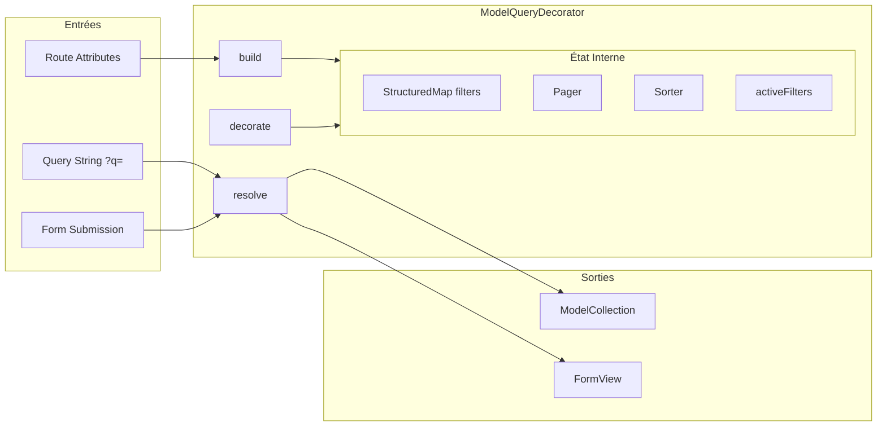
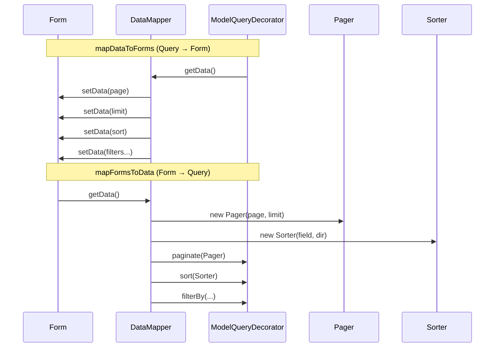

# Bridge/Symfony - Documentation Détaillée

Intégration Symfony complète : ValueResolver, Forms, Middleware attributes, ControllerInterface.

**Fichiers sources** :
- `src/Bridge/Symfony/Controller/ModelFactoryValueResolver.php`
- `src/Bridge/Symfony/Model/Query/ModelQueryDecorator.php`
- `src/Bridge/Symfony/Form/ModelQueryType.php`
- `src/Bridge/Symfony/Model/Attribute/Middleware.php`
- `src/Bridge/Symfony/Controller/ControllerInterface.php`
- `src/Bridge/Symfony/Event/ControllerSubscriber.php`

## Table des matières

1. [Vue d'ensemble](#vue-densemble)
2. [ModelFactoryValueResolver](#modelfactoryvalueresolver)
3. [ModelQueryDecorator](#modelquerydecorator)
4. [ModelQueryType](#modelquerytype)
5. [Query Gmail-Style](#query-gmail-style)
6. [Middleware Attribute](#middleware-attribute)
7. [ControllerInterface & Convention](#controllerinterface--convention)
8. [Exemples Complets](#exemples-complets)

---

## Vue d'ensemble

Le bridge Symfony intègre Cortex avec le framework Symfony :

```
┌─────────────────────────────────────────────────────────────────────────┐
│ Request HTTP                                                            │
└─────────────────────────────────────────────────────────────────────────┘
                                    │
                                    ▼
┌─────────────────────────────────────────────────────────────────────────┐
│ ModelFactoryValueResolver                                               │
│ - Détecte les paramètres typés (Collection ou Model)                   │
│ - Crée le query via factory->query()                                    │
│ - Applique les filtres depuis route attributes                          │
│ - Yield la collection ou le modèle résolu                              │
└─────────────────────────────────────────────────────────────────────────┘
                                    │
                                    ▼
┌─────────────────────────────────────────────────────────────────────────┐
│ Controller                                                              │
│ - Reçoit la collection/modèle injecté                                  │
│ - Peut décorer le query avec filtres/tri                               │
│ - Retourne array (ou Response)                                          │
└─────────────────────────────────────────────────────────────────────────┘
                                    │
                                    ▼
┌─────────────────────────────────────────────────────────────────────────┐
│ ControllerSubscriber                                                    │
│ - Convertit array → Response via template Twig                         │
│ - Convention: route name → template path                                │
└─────────────────────────────────────────────────────────────────────────┘
```

---

## ModelFactoryValueResolver

Injection automatique de collections et modèles dans les controllers.

**Fichier source** : `src/Bridge/Symfony/Controller/ModelFactoryValueResolver.php`

### Configuration

```php
class ModelFactoryValueResolver implements ValueResolverInterface
{
    public function __construct(
        private readonly array $factoryMapping,        // [Class => Factory]
        private readonly FormFactoryInterface $formFactory,
    )
}
```

Le `$factoryMapping` est construit automatiquement par le `ModelProcessorCompilerPass` depuis les attributs `#[Model]`.

### Flux de résolution

```php
public function resolve(Request $request, ArgumentMetadata $argument): iterable
{
    // 1. Vérifie si le type est une classe enregistrée
    if (!RegisteredClass::exists($argument->getType())) {
        return [];
    }

    $parameterType = new RegisteredClass($argument->getType());

    // 2. Cherche la factory correspondante
    if (!array_key_exists((string) $parameterType, $this->factoryMapping)) {
        return [];
    }

    $factory = $this->factoryMapping[(string) $parameterType];

    // 3. Crée le query avec build()
    $collection = $factory->query()
        ->build($this->formFactory, $request)
        ->getCollection();

    // 4. Si ModelCollection : yield la collection
    if ($parameterType->isInstanceOf(ModelCollection::class)) {
        yield $collection;
        return;
    }

    // 5. Si Model : applique filtres depuis route params
    $queryFilters = array_filter(
        $request->query->all() + $request->attributes->all(),
        fn ($key) => $collection->query->filters->has($key),
        ARRAY_FILTER_USE_KEY
    );

    if (empty($queryFilters)) {
        if ($argument->isNullable()) {
            return null;
        }
        throw new NotFoundHttpException("No filter keys found");
    }

    // 6. Yield first() ou NotFoundHttpException
    $model = $collection->first();
    if (!$model && !$argument->isNullable()) {
        throw new NotFoundHttpException("No instance found");
    }

    yield $model;
}
```

### Comportement selon le type

#### Pour une Collection

```php
#[Route('/contacts', name: 'admin/contact/index')]
public function __invoke(ContactCollection $contacts): array
{
    // $contacts est une ModelCollection lazy
    // Les filtres viennent de la Request (query params, form)
    return ['contacts' => $contacts->toArray()];
}
```

#### Pour un Model unique

```php
#[Route('/contacts/{uuid}', name: 'admin/contact/show')]
public function __invoke(Contact $contact): array
{
    // 'uuid' est extrait de $request->attributes
    // La collection est filtrée par uuid
    // first() est appelé automatiquement
    return ['contact' => $contact];
}
```

#### Pour un Model nullable

```php
#[Route('/contacts/{uuid?}', name: 'admin/contact/edit')]
public function __invoke(?Contact $contact): array
{
    // Si uuid est null → $contact = null (création)
    // Si uuid non trouvé → $contact = null (pas d'exception)
    return ['contact' => $contact];
}
```

---

## ModelQueryDecorator

Extension de `ModelQuery` pour l'intégration Symfony avec formulaires et filtres.

**Fichier source** : `src/Bridge/Symfony/Model/Query/ModelQueryDecorator.php`

### Diagramme d'interaction

Le diagramme suivant montre comment `ModelQueryDecorator` orchestre les entrées (route, query string, form) vers les sorties (collection, form view) :



> **Pagination opt-in** : `ModelQuery` n'a pas de pager par defaut. Sans appel explicite a `->paginate(new Pager(...))`, toutes les lignes sont retournees. Le `ModelQueryDecorator` pose automatiquement un pager depuis les parametres de la requete HTTP (`?page=1&limit=20`).

### Structure

```php
class ModelQueryDecorator extends ModelQuery
{
    private ?FormFactoryInterface $formFactory = null;
    private ?Request $request = null;
    private ?FormBuilderInterface $formBuilder = null;
    private ?FormInterface $form = null;

    private array $filtersConfig = [];     // Config des filtres
    private array $activeFilters = [];     // Filtres actifs (pour chips)
}
```

### Méthodes principales

#### build()

Initialise le décorateur avec Symfony.

```php
public function build(FormFactoryInterface $formFactory, Request $request): self
```

```php
$query = $factory->query()
    ->build($formFactory, $request);
```

#### decorate()

Configure le tri et les filtres.

```php
public function decorate(array $sortables, \Closure|array|null $filters = null): self
```

**Paramètres :**
- `$sortables` : Champs triables (ex: `['name', 'createdAt']`)
- `$filters` : Configuration des filtres (array ou closure legacy)

**Format des filtres (array) :**
```php
$query->decorate(
    sortables: ['name', 'createdAt', 'email'],
    filters: [
        'name' => [
            'type' => 'text',
            'label' => 'Nom',
        ],
        'type' => [
            'type' => 'enum',
            'label' => 'Type',
            'choices' => [
                ['value' => 'individual', 'label' => 'Individuel'],
                ['value' => 'company', 'label' => 'Entreprise'],
            ],
            'placeholder' => 'Tous les types',
        ],
        'isActive' => [
            'type' => 'boolean',
            'label' => 'Actif',
        ],
    ]
);
```

**Filtres sur les relations jointes (underscore notation) :**

Les formulaires Symfony n'acceptent pas les points dans les noms de champs. Pour filtrer sur une relation jointe, utilisez la notation underscore (`relation_field` au lieu de `relation.field`) :

```php
// ❌ Ne fonctionne pas avec les formulaires Symfony
'contact.firstname' => ['type' => 'text', 'label' => 'Prénom']

// ✅ Utilisez la notation underscore
'contact_firstname' => ['type' => 'text', 'label' => 'Prénom']
```

Le `DbalMappingConfiguration->resolveJoinFilter()` supporte les deux notations et résout automatiquement `contact_firstname` vers le join `contact` et le champ `firstname`.

#### resolve()

Résout le query avec traitement des filtres.

```php
public function resolve(): \Generator
{
    // 1. Applique les filtres depuis route attributes
    foreach ($this->request->attributes->all() as $key => $value) {
        if (str_starts_with($key, '_')) continue;  // Skip internals
        if ($this->filters->hasDeclaredKey($key)) {
            $this->filterBy($key, $value);
        } else {
            $this->tags->set($key, $value);  // Tag
        }
    }

    // 2. Parse q parameter (Gmail-style)
    $this->parseQueryString($this->request->query->get('q', ''));

    // 3. Handle form submission
    if ($this->formBuilder) {
        $this->form = $this->formBuilder->getForm();
        $this->form->handleRequest($this->request);
        if ($this->form->isSubmitted() && !$this->form->isValid()) {
            throw new BadRequestException(...);
        }
    }

    return parent::resolve();
}
```

#### getDecorator()

Retourne le FormView pour le template.

```php
public function getDecorator(): FormView
```

```php
return [
    'contacts' => $contacts->toArray(),
    'decorator' => $contacts->query->getDecorator(),
];
```

---

## Déduplication avec unique()

La méthode `unique()` permet de dédupliquer les résultats par un champ spécifique. Utile quand on requête une table de jointure (ex: Role) mais qu'on veut des résultats uniques par une relation (ex: Contact).

### Usage

```php
$query->unique('contact');  // Un résultat par contact
```

### Exemple complet : Liste de contacts via leurs rôles

```php
#[Route('/contacts', methods: ['GET'])]
class ContactListAction implements ControllerInterface
{
    public function __construct(
        private readonly OrganisationContext $organisationContext,
    ) {}

    public function __invoke(RoleCollection $roles): array
    {
        $currentOrg = $this->organisationContext->getCurrent();
        $query = $roles->query;

        // Filtrer par organisation active
        $query->filter(organisationUuid: $currentOrg['uuid']);
        $query->filter(archivedAt: null);

        // Dédupliquer : un seul résultat par contact
        // (même si un contact a plusieurs rôles dans l'organisation)
        $query->unique('contact');

        $query->decorate(
            sortables: ['contact_firstname', 'contact_lastname', 'role'],
            filters: [
                'contact_firstname' => ['type' => 'text', 'label' => 'Prénom'],
                'contact_lastname' => ['type' => 'text', 'label' => 'Nom'],
                'role' => ['type' => 'enum', 'label' => 'Rôle', 'choices' => [...]],
            ]
        );

        return [
            'collection' => $roles->toArray(),
            'form' => $query->getDecorator(),
            'pager' => $query->pager,
        ];
    }
}
```

### Fonctionnement interne

1. `ModelQuery->unique('contact')` stocke le champ dans `$uniqueField`
2. `DbalAdapter` traduit en `GROUP BY` sur la colonne correspondante
3. Le mapper résout le nom du champ en colonne SQL via `DbalMappingConfiguration->resolveUniqueField()`
4. Le COUNT pour la pagination utilise `COUNT(DISTINCT colonne)`

### SQL généré

```sql
-- Requête principale
SELECT contact_role.contact_uuid, ...
FROM contact_role
INNER JOIN contact_contact AS c1 ON contact_role.contact_uuid = c1.uuid
WHERE contact_role.organisation_uuid = :orgUuid
GROUP BY contact_role.contact_uuid
ORDER BY c1.lastname ASC
LIMIT 20 OFFSET 0

-- Requête count pour pagination
SELECT COUNT(DISTINCT contact_role.contact_uuid) AS count
FROM contact_role
WHERE contact_role.organisation_uuid = :orgUuid
```

---

## ModelQueryType

Form Type pour la pagination, le tri et les filtres.

**Fichier source** : `src/Bridge/Symfony/Form/ModelQueryType.php`

### Options

```php
$resolver->setDefaults([
    'method' => 'GET',
    'data_class' => ModelQueryDecorator::class,
    'csrf_protection' => false,
    'page_sizes' => [10, 20, 50, 100],
    'sortable_fields' => [],
    'filters_config' => [],
    'default_page_size' => 20,
]);
```

### Champs générés

```php
public function buildForm(FormBuilderInterface $builder, array $options): void
{
    // Recherche Gmail-style
    $builder->add('q', TextType::class, [
        'required' => false,
        'mapped' => false,
    ]);

    // Pagination
    $builder
        ->add('page', IntegerType::class, ['required' => false])
        ->add('limit', ChoiceType::class, [
            'choices' => [10 => 10, 20 => 20, 50 => 50, 100 => 100],
        ]);

    // Tri (radio buttons)
    $builder->add('sort', ChoiceType::class, [
        'expanded' => true,
        'choices' => ['name_asc' => 'name_asc', 'name_desc' => 'name_desc', ...],
    ]);

    // Filtres dynamiques
    foreach ($options['filters_config'] as $fieldName => $config) {
        match ($config['type'] ?? 'text') {
            'text' => $builder->add($fieldName, TextType::class, ...),
            'enum', 'choice' => $builder->add($fieldName, ChoiceType::class, ...),
            'boolean' => $builder->add($fieldName, ChoiceType::class, [
                'choices' => ['Oui' => '1', 'Non' => '0'],
            ]),
            default => $builder->add($fieldName, TextType::class, ...),
        };
    }
}
```

### DataMapper

Implémente `DataMapperInterface` pour mapper Form ↔ ModelQuery.

Le diagramme suivant illustre la synchronisation bidirectionnelle entre le formulaire et le query :



```php
// Form → Query
public function mapFormsToData(\Traversable $forms, mixed &$modelQuery): void
{
    $modelQuery->paginate(new Pager(
        $forms['page']->getData() ?? 1,
        $forms['limit']->getData() ?? 20
    ));

    if ($sortString = $forms['sort']->getData()) {
        // Parse "name_asc" → Sorter('name', ASC)
        $modelQuery->sort(new Sorter($field, $direction));
    }

    // Map custom filters
    foreach ($filterForms as $name => $form) {
        if ($form->getData() !== null) {
            $modelQuery->filters->set($name, $form->getData());
        }
    }
}

// Query → Form (initial display)
public function mapDataToForms(mixed $modelQuery, \Traversable $forms): void
{
    $forms['page']->setData($modelQuery->pager?->page ?? 1);
    $forms['limit']->setData($modelQuery->pager?->nbPerPage ?? 20);
    // etc.
}
```

### finishView()

Ajoute des variables au FormView.

```php
public function finishView(FormView $view, FormInterface $form, array $options): void
{
    // Liste des champs : l'ordre est déterminé par filters_config
    $filterConfigKeys = array_keys($options['filters_config'] ?? []);
    $sortableFields = $options['sortable_fields'] ?? [];
    $view->vars['fields'] = array_unique(array_merge($filterConfigKeys, $sortableFields));

    // Filtres (sans q, page, limit, sort)
    $view->vars['filters'] = array_diff_key($view->children, [...]);

    // Sorts : données pour rendu manuel (évite problème de "already rendered")
    $view->vars['sorts'] = [
        'name' => [
            'asc' => ['name' => 'sort', 'value' => 'name_asc', 'checked' => false],
            'desc' => ['name' => 'sort', 'value' => 'name_desc', 'checked' => true],
        ],
    ];

    // Config pour JS
    $view->vars['filters_config'] = $options['filters_config'];
}
```

### Ordre des colonnes

**Important** : L'ordre des colonnes dans les templates de liste est déterminé par l'ordre des clés dans le tableau `filters` de `decorate()`, suivi des champs `sortables` qui ne sont pas dans `filters`.

```php
// Les colonnes apparaîtront dans cet ordre : firstname, lastname, role, email
$query->decorate(
    sortables: ['firstname', 'lastname', 'role', 'email'],
    filters: [
        'firstname' => ['type' => 'text', 'label' => 'Prénom'],
        'lastname' => ['type' => 'text', 'label' => 'Nom'],
        'role' => ['type' => 'enum', 'label' => 'Rôle', 'choices' => [...]],
        'email' => ['type' => 'text', 'label' => 'Email'],
    ]
);
```

Pour changer l'ordre des colonnes, il suffit de réorganiser les clés dans le tableau `filters`.

---

## Query Gmail-Style

Le paramètre `q` permet une recherche style Gmail.

### Format

```
?q=field:value field2:"value with spaces" field3:~partial%
```

### Parsing

```php
private function parseQueryString(string $query): void
{
    // Regex: /(\w+):(?:"([^"]+)"|(\S+))/
    // Matche: name:Jean, status:"En attente", email:~test%

    preg_match_all($pattern, $query, $matches, PREG_SET_ORDER);

    foreach ($matches as $match) {
        $field = $match[1];
        $value = $match[2] ?: $match[3];

        if ($this->filters->hasDeclaredKey($field) || isset($this->filtersConfig[$field])) {
            $this->filterBy($field, $value);

            // Build active filter chip
            $this->activeFilters[] = [
                'field' => $field,
                'label' => $this->filtersConfig[$field]['label'] ?? ucfirst($field),
                'value' => $value,
                'display' => $this->formatFilterDisplay($field, $value),
            ];
        }
    }
}
```

### Exemples

```
# Filtres simples
?q=name:Jean
?q=status:active type:club

# Valeurs avec espaces
?q=name:"Jean Dupont"

# Opérateurs
?q=age:>18 score:>=50

# LIKE patterns
?q=email:~%@gmail.com

# Combinés
?q=type:club name:~Bridge% isActive:1
```

### Active Filters (Chips)

Les filtres parsés sont stockés pour affichage :

```php
$this->activeFilters = [
    [
        'field' => 'type',
        'label' => 'Type',
        'value' => 'club',
        'display' => 'Club',  // Label traduit pour enum
    ],
    [
        'field' => 'isActive',
        'label' => 'Actif',
        'value' => '1',
        'display' => 'Oui',
    ],
];
```

Template :
```twig

    <span class="chip">
        {{ filter.label }}: {{ filter.display }}
        <button data-remove-filter="{{ filter.field }}">×</button>
    </span>

```

---

## Middleware Attribute

Déclare un middleware pour un modèle.

**Fichier source** : `src/Bridge/Symfony/Model/Attribute/Middleware.php`

### Syntaxe

```php
#[Middleware(
    modelClass: Club::class,      // Classe du modèle
    on: Scope::All,               // Quand s'applique
    handler: 'onDbal',            // Méthode à appeler
    priority: 2                   // Plus haut = exécuté en premier
)]
class DbalClubMapper implements ModelMiddleware
```

### Paramètres

| Paramètre | Type | Défaut | Description |
|-----------|------|--------|-------------|
| `modelClass` | `string` | - | Classe du modèle cible |
| `on` | `Scope` | `Scope::All` | Scope d'application |
| `handler` | `string` | `'__invoke'` | Méthode handler |
| `priority` | `int` | `10` | Priorité (desc) |

### Scope

```php
enum Scope
{
    case All;     // Query, Sync, Remove
    case Query;   // Seulement les lectures
    case Sync;    // Seulement les écritures
    case Remove;  // Seulement les suppressions
}
```

### Discovery

Le `ModelProcessorCompilerPass` :
1. Scanne les classes avec `#[Middleware]`
2. Enregistre les middlewares dans les factories
3. Configure le `$factoryMapping` pour le ValueResolver

---

## ControllerInterface & Convention

### ControllerInterface

Interface marker pour les controllers Cortex.

```php
interface ControllerInterface
{
}
```

### Convention de templates

Le `ControllerSubscriber` convertit le retour array en Response.

```php
public function onControllerView(ViewEvent $event)
{
    $routeName = $request->attributes->get('_route');
    $format = $request->attributes->get('_format', 'html');

    // Template chain à tester
    $templateChain = [
        $routeName,                              // admin/club/index
        sprintf('%s.%s.twig', $routeName, $format),  // admin/club/index.html.twig
    ];

    foreach ($templateChain as $templatePath) {
        if ($this->templateEngine->getLoader()->exists($templatePath)) {
            $event->setResponse(new Response(
                $this->templateEngine->render($templatePath, $event->getControllerResult())
            ));
            return;
        }
    }

    // Fallback JSON si format=json
    if ($format === 'json') {
        $event->setResponse(new JsonResponse($result));
    }
}
```

### Mapping route → template

| Route name | Template |
|------------|----------|
| `admin/club/index` | `templates/admin/club/index.html.twig` |
| `admin/contact/edit` | `templates/admin/contact/edit.html.twig` |
| `api/v1/clubs` | JSON response (si Accept: application/json) |

---

## Exemples Complets

### Exemple 1 : Controller de liste avec filtres

```php
#[Route('/clubs', name: 'admin/club/index')]
class ClubListAction implements ControllerInterface
{
    public function __invoke(ClubCollection $clubs): array
    {
        // Décorer avec tri et filtres
        $clubs->query->decorate(
            sortables: ['name', 'createdAt', 'organisation.name'],
            filters: [
                'name' => ['type' => 'text', 'label' => 'Nom'],
                'isActive' => ['type' => 'boolean', 'label' => 'Actif'],
                'organisation.type' => [
                    'type' => 'enum',
                    'label' => 'Type d\'organisation',
                    'choices' => [
                        ['value' => 'club', 'label' => 'Club'],
                        ['value' => 'association', 'label' => 'Association'],
                    ],
                ],
            ]
        );

        return [
            'clubs' => $clubs->toArray(),
            'decorator' => $clubs->query->getDecorator(),
        ];
    }
}
```

### Exemple 2 : Controller d'édition

```php
#[Route('/clubs/{uuid}/edit', name: 'admin/club/edit')]
class ClubEditAction implements ControllerInterface
{
    public function __construct(
        private readonly Handler $handler,
    ) {}

    public function __invoke(
        Club $club,
        Request $request,
        #[MapRequestPayload] ?Command $command = null,
    ): array|Response {
        if ($command) {
            $response = ($this->handler)($command);
            return new RedirectResponse('/clubs');
        }

        return ['club' => $club];
    }
}
```

### Exemple 3 : Template avec decorator

```twig
{# templates/admin/club/index.html.twig #}



    {# Barre de recherche Gmail-style #}
    <form method="get">
        {{ form_widget(decorator.q, {attr: {placeholder: 'Rechercher...'}}) }}
        <button type="submit">Rechercher</button>
    </form>

    {# Chips des filtres actifs #}
    
        <span class="chip">
            {{ filter.label }}: {{ filter.display }}
        </span>
    

    {# Liste #}
    <table>
        <thead>
            <tr>
                <th>
                    Nom
                    
                        <a href="?sort=name_asc">↑</a>
                        <a href="?sort=name_desc">↓</a>
                    
                </th>
            </tr>
        </thead>
        <tbody>
            
                <tr>
                    <td>{{ club.name }}</td>
                </tr>
            
        </tbody>
    </table>

    {# Pagination #}
    
    
        <nav>
            
                <a href="?page={{ page }}"
                   class="{{ page == pager.page ? 'active' : '' }}">
                    {{ page }}
                </a>
            
        </nav>
        <span>{{ pager.nbRecords }} résultats</span>
    

```

### Exemple 4 : Configuration services.yaml

```yaml
services:
    # ValueResolver
    Cortex\Bridge\Symfony\Controller\ModelFactoryValueResolver:
        arguments:
            $factoryMapping: []  # Rempli par CompilerPass
            $formFactory: '@form.factory'
        tags:
            - { name: controller.argument_value_resolver, priority: 150 }

    # ControllerSubscriber
    Cortex\Bridge\Symfony\Event\ControllerSubscriber:
        arguments:
            $router: '@router'
            $templateEngine: '@twig'
            $logger: '@logger'
        tags:
            - { name: kernel.event_subscriber }

    # Auto-tag des controllers
    _instanceof:
        Cortex\Bridge\Symfony\Controller\ControllerInterface:
            tags: ['controller.service_arguments']
```

### Exemple 5 : Middleware personnalisé

```php
use Cortex\Bridge\Symfony\Model\Attribute\Middleware;
use Cortex\Component\Model\Scope;

#[Middleware(Contact::class, on: Scope::Query, handler: 'onQuery', priority: 5)]
class ContactValidationMiddleware implements ModelMiddleware
{
    public function onQuery(Middleware $chain, ModelQuery $query): \Generator
    {
        // Validation/modification avant exécution
        if (!$query->filters->has('organisationUuid')) {
            throw new \InvalidArgumentException('organisationUuid filter required');
        }

        // Continue la chaîne
        foreach ($chain->next() as $identifier => $data) {
            // Post-traitement
            yield $identifier => $data;
        }
    }
}
```
