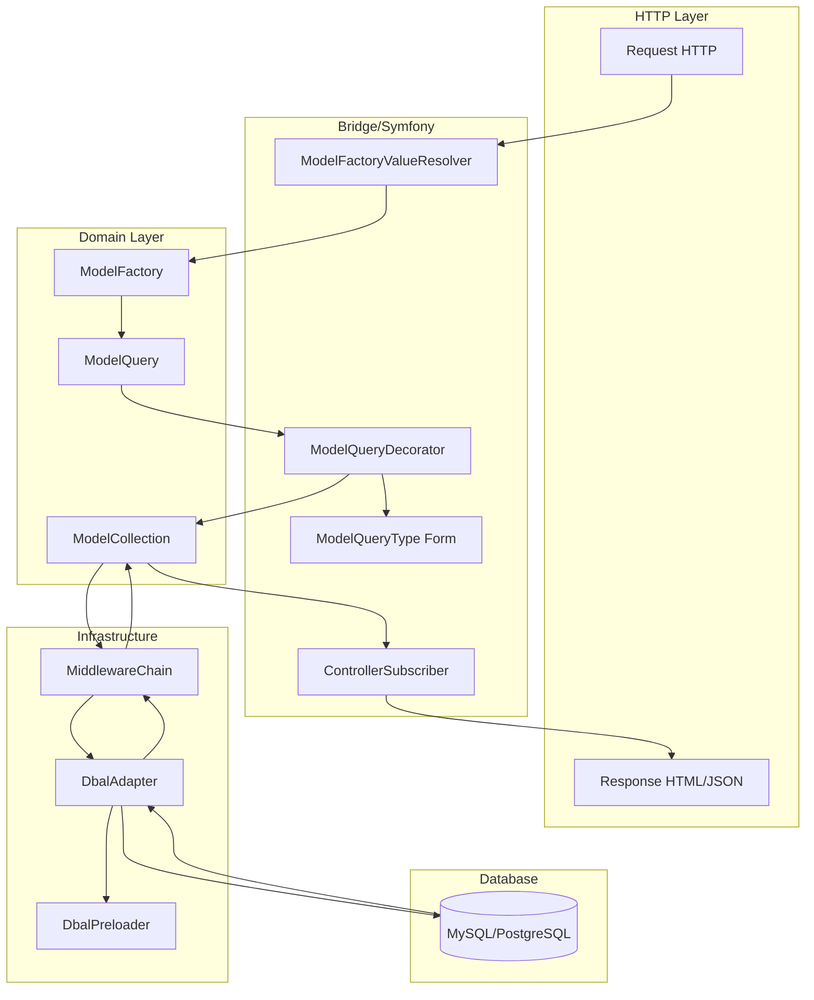

# Cortex Framework Documentation

Cortex est un framework DDD (Domain-Driven Design) pour PHP 8.4+ et Symfony 7.4. Il fournit des abstractions pour la transformation de données, les collections lazy, la persistence DBAL et l'intégration Symfony.

## Architecture Globale

```
┌─────────────────────────────────────────────────────────────────────────┐
│                           Application Layer                              │
│  Controllers, Forms, Commands                                           │
│  → Utilise ModelFactory.query() pour récupérer des collections          │
│  → Utilise les Actions DDD pour les mutations                           │
└─────────────────────────────────────────────────────────────────────────┘
                                    │
                                    ▼
┌─────────────────────────────────────────────────────────────────────────┐
│                            Domain Layer                                  │
│  Models, Collections, Factories, Stores                                 │
│  → ModelFactory crée des queries avec resolver                          │
│  → Actions encapsulent la logique métier                                │
└─────────────────────────────────────────────────────────────────────────┘
                                    │
                                    ▼
┌─────────────────────────────────────────────────────────────────────────┐
│                         Infrastructure Layer                             │
│  DBAL Mappers, External Services                                        │
│  → MiddlewareChain orchestre les transformations                        │
│  → DbalAdapter génère et exécute le SQL                                 │
│  → ArrayMapper transforme les données DB ↔ Model                        │
└─────────────────────────────────────────────────────────────────────────┘
```

## Composants Principaux

### 1. [ArrayMapper](./array-mapper.md)

Transforme des tableaux entre deux formats (typiquement DB ↔ Model). C'est la pierre angulaire du mapping dans Cortex.

```php
// DB → Model
$mapper = new ArrayMapper(
    mapping: [
        'uuid' => fn(string $uuid) => new Uuid($uuid),
        'isActive' => Value::Bool,
    ],
    format: Strategy::AutoMapCamel
);
$modelData = $mapper->map($dbRow);
```

### 2. [AsyncCollection / ModelCollection](./async-collection.md)

Collections lazy avec propagation de contexte. Les données ne sont chargées qu'au moment de la consommation.

```php
$collection = AsyncCollection::create(fn() => $expensiveQuery())
    ->filter(fn($x) => $x->isActive)  // Lazy - pas d'exécution
    ->map(fn($x) => $x->name);        // Lazy - pas d'exécution

$results = $collection->toArray();     // Exécution ici !
```

### 3. [Bridge/Doctrine](./bridge-doctrine.md)

Persistence DBAL avec support des JOINs et prévention des problèmes N+1 via preloading.

```php
$config = new DbalMappingConfiguration(
    table: 'club_club',
    joins: [
        'organisation' => new JoinDefinition(
            factory: $orgFactory,
            joinConfig: $orgMapper->getConfiguration(),
            localKey: 'organisation_uuid',
        ),
    ],
    modelToTableMapper: new ArrayMapper([...]),
    tableToModelMapper: new ArrayMapper([...]),
);
```

### 4. [Bridge/Symfony](./bridge-symfony.md)

Intégration Symfony complète : ValueResolver, Forms, Middleware attributes.

```php
#[Route('/clubs', name: 'admin/club/index')]
class ClubListAction implements ControllerInterface
{
    public function __invoke(ClubCollection $clubs): array
    {
        return ['clubs' => $clubs->toArray()];
    }
}
```

### 5. [Action Events](./events.md)

Système d'événements pour intercepter et modifier les réponses des Actions. Compatible PSR-14.

```php
class Handler implements ActionHandler, EventDispatcherAwareInterface
{
    use EmitsActionEvents;

    public function __invoke(Command $command): Response
    {
        // ... logique métier ...

        $this->emit($event = new Event(new Response($model)));

        return $event->getResponse(); // Peut être modifiée par les listeners
    }
}
```

## Flux de Données Typique

Le diagramme suivant illustre le flux complet d'une requête HTTP jusqu'au rendu de la collection :



**Étapes détaillées :**

```
┌─────────────────────────────────────────────────────────────────────────┐
│ 1. Controller reçoit une requête                                        │
│    → ModelFactoryValueResolver injecte ContactCollection                │
└─────────────────────────────────────────────────────────────────────────┘
                                    │
                                    ▼
┌─────────────────────────────────────────────────────────────────────────┐
│ 2. ModelFactory.query() crée un ModelQuery                              │
│    → Le query encapsule les filtres, pagination, tri                    │
└─────────────────────────────────────────────────────────────────────────┘
                                    │
                                    ▼
┌─────────────────────────────────────────────────────────────────────────┐
│ 3. ModelCollection.build(query) crée une collection lazy                │
│    → La résolution est différée jusqu'à la consommation                 │
└─────────────────────────────────────────────────────────────────────────┘
                                    │
                                    ▼
┌─────────────────────────────────────────────────────────────────────────┐
│ 4. Premier accès (toArray, first, foreach...)                           │
│    → MiddlewareChain.run() exécute les middlewares                      │
│    → DbalAdapter génère et exécute le SQL                               │
│    → tableToModelMapper transforme les rows en données model            │
│    → ModelFactory.instancePipeline() crée les objets Model              │
└─────────────────────────────────────────────────────────────────────────┘
```

## Concepts Clés

### Lazy Evaluation

Toutes les collections sont lazy par défaut. Les opérations `map()`, `filter()`, `each()` créent de nouvelles collections sans exécuter de code. L'exécution ne démarre qu'au premier accès aux données.

### Middleware Chain

Les middlewares s'exécutent en chaîne ordonnée par priorité (haut → bas). Chaque middleware peut transformer les données avant de passer au suivant.

```php
#[Middleware(Club::class, on: Scope::All, handler: 'onDbal', priority: 2)]
class DbalClubMapper implements ModelMiddleware
{
    public function onDbal(Middleware $chain, $command): \Generator
    {
        // Traitement avant
        foreach ($this->dbal->onModelQuery($chain, $command) as $id => $data) {
            // Transformation des données
            yield $id => $data;
        }
    }
}
```

### Preloading & N+1 Prevention

Les JOINs automatiques préchargent les données des relations. Le `DbalPreloader` stocke ces données pour éviter les requêtes N+1.

### Bidirectional Mapping

`ArrayMapper` gère la transformation dans les deux sens :
- `modelToTableMapper` : Model → DB (persist)
- `tableToModelMapper` : DB → Model (fetch)

## Quick Start

### Créer un modèle avec CRUD complet

```bash
# 1. Créer le modèle DDD avec mapper DBAL
./bin/php bin/console make:cortex:model Contact Person --dbal

# 2. Créer le CRUD complet
./bin/php bin/console make:cortex:crud Admin Contact Person
```

### Utiliser dans un controller

```php
#[Route('/persons', name: 'admin/person/index')]
class PersonListAction implements ControllerInterface
{
    public function __invoke(PersonCollection $persons): array
    {
        return ['persons' => $persons->toArray()];
    }
}
```

### Ajouter des filtres

```php
public function __invoke(PersonCollection $persons): array
{
    // Les filtres sont automatiquement appliqués depuis la Request
    // via ModelQueryDecorator

    $query = $persons->query;
    $query->decorate(
        sortables: ['name', 'createdAt'],
        filters: [
            'name' => ['type' => 'text', 'label' => 'Nom'],
            'type' => [
                'type' => 'enum',
                'label' => 'Type',
                'choices' => [
                    ['value' => 'individual', 'label' => 'Individuel'],
                    ['value' => 'company', 'label' => 'Entreprise'],
                ],
            ],
        ]
    );

    return ['persons' => $persons->toArray()];
}
```

## Documentation Détaillée

- **[ArrayMapper](./array-mapper.md)** - Transformation de données bidirectionnelle
- **[AsyncCollection](./async-collection.md)** - Collections lazy avec context propagation
- **[Bridge/Doctrine](./bridge-doctrine.md)** - Persistence DBAL avec JOINs et preloading
- **[Bridge/Symfony](./bridge-symfony.md)** - Intégration Symfony complète
- **[Action Events](./events.md)** - Système d'événements pour les Actions
- **[Makers](./makers.md)** - Générateurs de code
